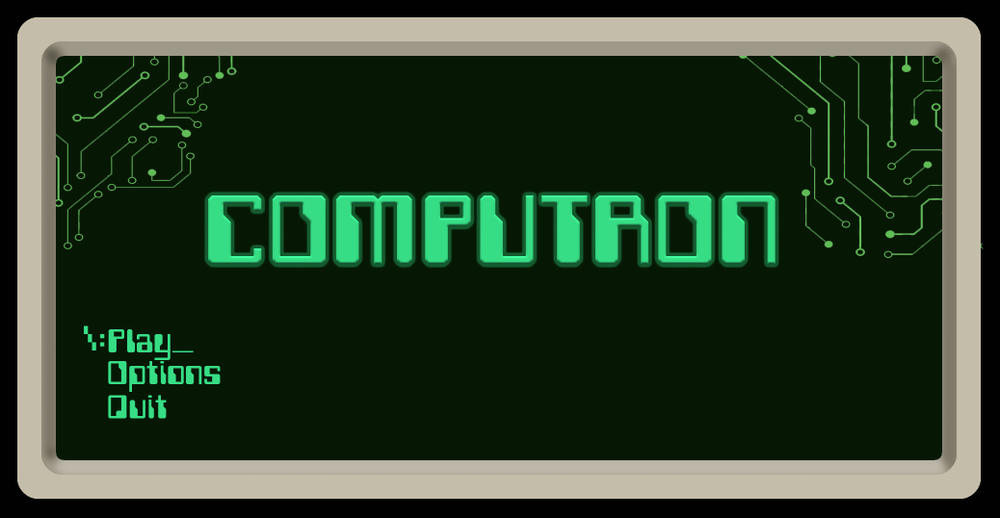

# Projects

## SuperVoid
*   [Project Repository](https://github.com/MrLever/SuperVoid)

### Summary
SuperVoid is my latest games project. It's a made-from-scratch clone of Asteroids made with C++20 and OpenGL. SuperVoid is currently under development, and v1.0 is should be done around December 2019.

### Current Features
-   Keyboard, Mouse, and Gamepad Controls
-   Custom 3D Renderer written with OpenGL 4.5
-   Flexible Entity-Component system to allow rapid iteration of gameplay entities
-   Powerful framework utility classes that allow
  - Multithreading
  - Resource Allocation/Caching
  - Asynchronous File I/O
  - FNV1a String hashing for fast comparisons

### Planned Features
- Simple Physics/Collision Engine
- UI Rendering
- Text Rendering
- Audio Framework
- General Reduction in jankiness

## Computron
*   [Conference Paper](./assets/Computron/Computron_conference_paper.pdf)
*   [Design Documentation](./assets/Computron/ComputronDesignDocument.pdf)
*   [Windows Build](https://drive.google.com/open?id=1Zd70CsJta8AJ_XGvRc81Er-DYy5SdbWq)
*   [**(Unstable)** WebGL Player](https://cop4934-fall19-group32.github.io/)

### Summary
Computron is a 2D puzzle game developed using Unity. It was developed over the span of 9 months as a project for UCF's Senior Design course with a team of four programmers and two volunteer artists. The game focuses on providing players a gentle introduction to the world of computational thinking and problem solving. We have decided to turn this project back over to UCF's Computer Science department 

## Master Blaster 
*   [Project Repository](https://github.com/Team-11-Games/MasterBlaster)
*   [My Contributions](./assets/NicolasLaCognataMasterBlasterContributions.pdf)
*   [Project Wiki](https://github.com/Team-11-Games/MasterBlaster/wiki)

### Summary
Master Blaster was a project I made for my AI for Game Programming class with a team of two others. The objective of the class was to rapidly prototype and deliver a fun game that featured artificial intelligence in some novel way. There was no restriction on engine, genre, mechanics, or scope. It was up to the individual teams to conceive and deliver a fun gameplay experience. 

Our game turned out to be different from many of our classmate's creations, and it gave us the opportunity to solve some unique problems. Problems like unit control, turn management, and level generation had huge impact on the feel of our game. 

